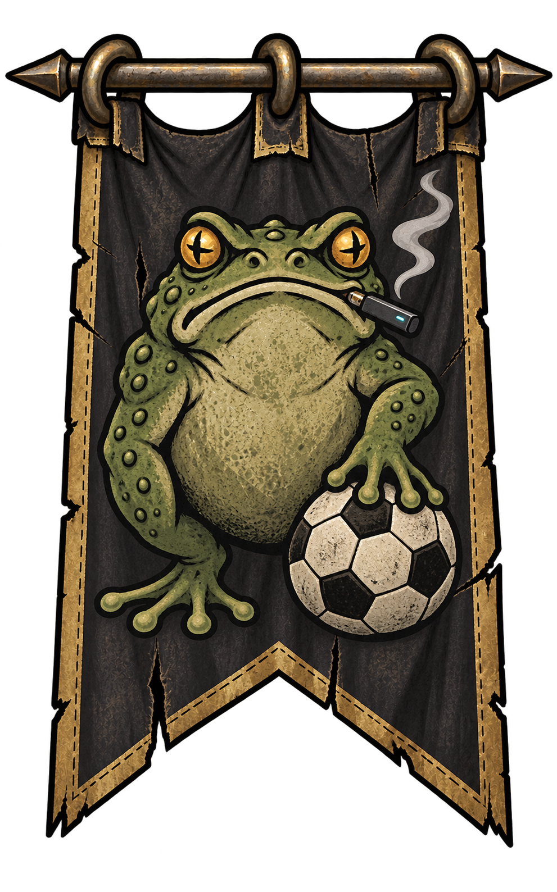
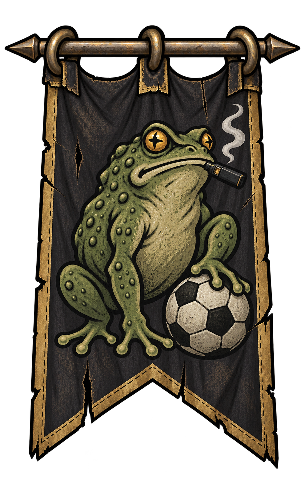
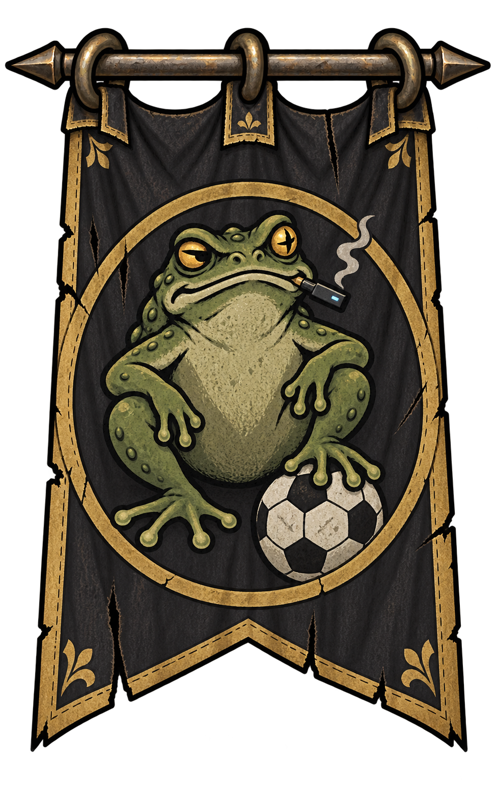
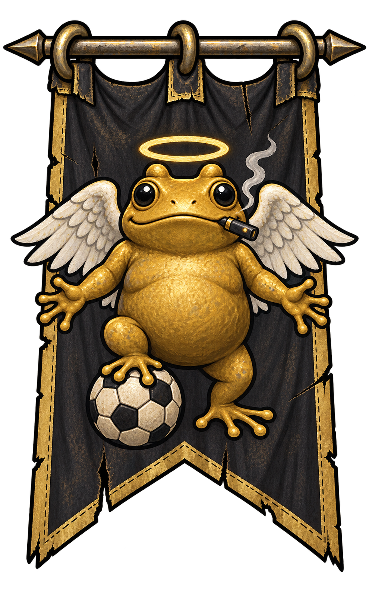

# 蛤蟆旗帜备选素材

2026-09-28，使用内置 imagegen 生成。四款均为透明背景 PNG，包含嘴叼电子烟、脚踩足球。黄金天使蛙参考用户提供的金色圆身、大黑眼、白色翅膀和光环。

[打开四款对比预览](index.html)

这四款已与首版黑金蛤蟆旗一起接入 v0.25.0 Mod。世界地图按 F8 → 战团事务 → 更换旗帜；选择随存档保存，旗帜与战旗物品图标同步更新。这里保留生成原图，游戏包内使用适配尺寸后的资源。

## 方案 1：正面踩球

[PNG 原图](01-toad-front.png)



<details>
<summary>生成提示词</summary>

```text
Use case: stylized-concept. Asset type: original transparent 2D medieval mercenary company banner sprite for Battle Brothers. Image 1 is the existing banner STYLE reference: preserve its hand-painted illustrated cloth, confident dark outlines and restrained flat shading, compact bold heraldic emblem, tall front-facing hanging silhouette with metal crossbar and suspension rings. Create a new original variant, fully contained on canvas, isolated on TRUE TRANSPARENT ALPHA. No background scene, no ground shadow, no long vertical flagpole, no lettering or watermark. The emblem must show a green TOAD holding a modern compact rectangular electronic cigarette/vape in the corner of its mouth (not a tobacco cigarette, not a pipe), with one hind FOOT visibly RESTING ON TOP OF a clearly recognizable black-and-white pentagon-pattern SOCCER BALL. The soccer ball must sit BELOW the foot, with clear contact and not be held in hands. A tiny pale vapor curl makes the vape legible but does not obscure the face. Keep all three details readable at small game size. The cloth is a charcoal-black mercenary flag with aged gold trim, and the emblem fills the flag. Variant: confident front-facing chunky toad, squat stance with broad belly, strong amber bulging eyes and a wry broad mouth. One foot higher on the ball, the other planted. Simple strong composition without a frame around the animal. Two pointed swallowtail ends on the banner. Broad bright toad silhouette on dark cloth.
```

</details>

## 方案 2：侧身踩球

[PNG 原图](02-toad-profile.png)



<details>
<summary>生成提示词</summary>

```text
Use case: stylized-concept. Asset type: original transparent 2D medieval mercenary company banner sprite for Battle Brothers. Image 1 is the existing banner STYLE reference: preserve its hand-painted illustrated cloth, confident dark outlines and restrained flat shading, compact bold heraldic emblem, tall front-facing hanging silhouette with metal crossbar and suspension rings. Create a new original variant, fully contained on canvas, isolated on TRUE TRANSPARENT ALPHA. No background scene, no ground shadow, no long vertical flagpole, no lettering or watermark. The emblem must show a green TOAD holding a modern compact rectangular electronic cigarette/vape in the corner of its mouth (not a tobacco cigarette, not a pipe), with one hind FOOT visibly RESTING ON TOP OF a clearly recognizable black-and-white pentagon-pattern SOCCER BALL. The soccer ball must sit BELOW the foot, with clear contact and not be held in hands. A tiny pale vapor curl makes the vape legible but does not obscure the face. Keep all three details readable at small game size. The cloth is a charcoal-black mercenary flag with aged gold trim, and the emblem fills the flag. Variant: three-quarter profile toad facing viewer's right, head turned slightly toward us, sitting upright with proud chest, one bent hind foot planted on the soccer ball, the other balancing below. The short vape clearly protrudes from mouth toward the right. Banner ends in a single broad pointed bottom; narrow double gold stitching and slightly frayed fabric. Dynamic asymmetric heraldic composition.
```

</details>

## 方案 3：圆章蛤蟆

[PNG 原图](03-toad-medallion.png)



<details>
<summary>生成提示词</summary>

```text
Use case: stylized-concept. Asset type: original transparent 2D medieval mercenary company banner sprite for Battle Brothers. Image 1 is the existing banner STYLE reference: preserve its hand-painted illustrated cloth, confident dark outlines and restrained flat shading, compact bold heraldic emblem, tall front-facing hanging silhouette with metal crossbar and suspension rings. Create a new original variant, fully contained on canvas, isolated on TRUE TRANSPARENT ALPHA. No background scene, no ground shadow, no long vertical flagpole, no lettering or watermark. The emblem must show a green TOAD holding a modern compact rectangular electronic cigarette/vape in the corner of its mouth (not a tobacco cigarette, not a pipe), with one hind FOOT visibly RESTING ON TOP OF a clearly recognizable black-and-white pentagon-pattern SOCCER BALL. The soccer ball must sit BELOW the foot, with clear contact and not be held in hands. A tiny pale vapor curl makes the vape legible but does not obscure the face. Keep all three details readable at small game size. The cloth is a charcoal-black mercenary flag with aged gold trim, and the emblem fills the flag. Variant: compact frontal toad inside one large simple antique-gold circular heraldic border. Toad sits like a relaxed captain, a cocky side glance, one wide hind foot on the soccer ball at the bottom of the circle, hands resting on its knees. Vape clamped at the left mouth corner. No crowns or weapons. Broad square-ended cloth with a short central notch and restrained gold corner motifs. Clear bold symbol, less texture and fewer tiny details than the reference.
```

</details>

## 方案 4：黄金天使蛙

[PNG 原图](04-golden-angel.png)



<details>
<summary>生成提示词</summary>

```text
Use case: stylized-concept. Asset type: transparent 2D medieval company banner sprite for Battle Brothers. Image 1 is the existing dark banner's STYLE / hanging cloth reference. Image 2 is the GOLDEN FROG CHARACTER reference only: preserve its round chunky gold body, enormous glossy black eyes, broad small smile, white feathered wings and a luminous gold halo above its head. Do not copy the screenshot background, subtitles, watermark, video controls or lighting. Reinterpret this recognizable golden angel frog as a hand-painted bold heraldic emblem on a weathered charcoal-black tall cloth banner with aged gold border, simple hanging rings and crossbar. Full front-facing banner centered, fully inside the canvas, no long vertical flagpole. The gold frog is front-facing with wings spread to either side, halo clearly separate above; small short rectangular modern electronic cigarette held at the corner of its mouth with a subtle vapor curl, one hind foot visibly resting ON TOP OF a black-and-white pentagon-pattern soccer ball beneath its body. Keep the gold frog, wings, halo, vape, and ball readable and uncluttered at small game sprite size. Strong outlines, warm painted gold highlights, dark cloth contrast, modest swallowtail bottom. True transparent alpha background, no scene, no lettering, no watermarks, no drop shadow.
```

</details>

## 参考与参数

- 共同风格参考：`../sources/toad-banner.png`。
- 黄金蛙角色参考：`references/golden-frog.png`（用户提供的截图）。
- 模式：内置 `image_gen.imagegen`，每个方案单独生成。
- 参数：`transparent_background: true`；提供对应的本地参考图路径。
- 原始输出直接复制保存，保留透明通道。

