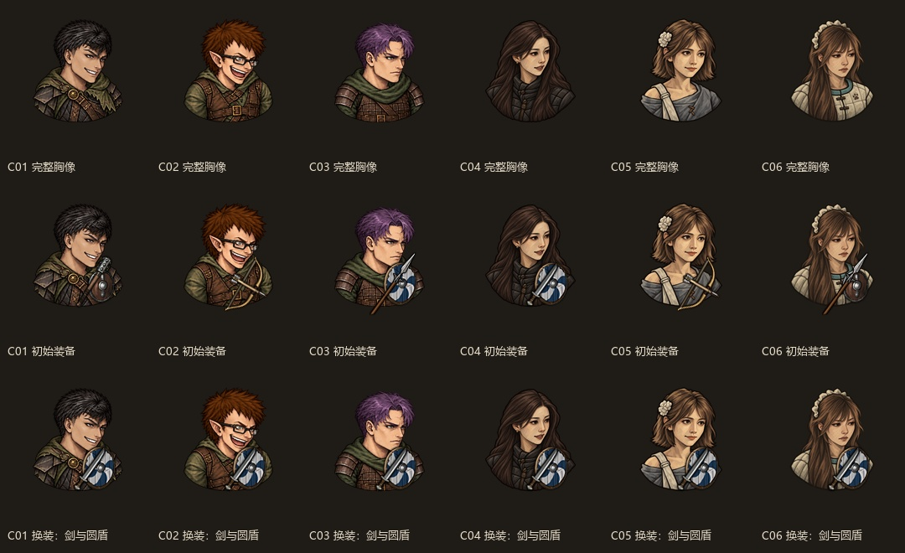
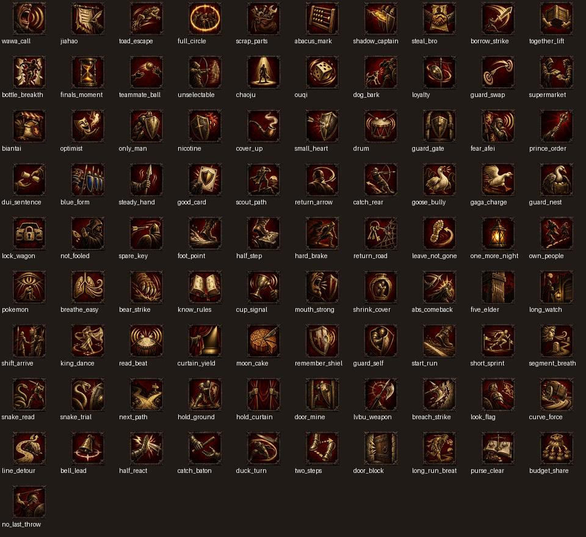

# 旧项目美术与人物对应索引

来源：`I:/afei-expedition`；归档日期：2026-09-25。素材副本位于 [旧项目参考目录](../../legacy/2026-09-25-afei-expedition/reference/)。完整原样快照、哈希清单与范围见[归档说明](../../legacy/2026-09-25-afei-expedition/README.md)。

## 使用规则

- 当前名单序号与旧 `Cxx` 编号不同，禁止按数字直接覆盖。旧 C02 是抹茶，旧 C03 是王大谋，旧 C06 是余初九。
- 以下对应关系用于寻找素材；不代表真人身份、相貌相似度或当前玩法均已验收。
- 旧 C26 芷芷与当前王大芷的对应仍待确认；旧 C29 一凹瑶不能当成瑶瑶牙，瑶瑶牙的旧编号是 C27。
- 旧 C11 川神图片和背景仍在，旧版当前人物数据却已移除，其技能由小宁沿用，不能直接整包移植。
- 所有旧版候选图、母图、图层与废案均已保留；名为 final 的历史总览不自动代表最新可用版本。

## 文件入口

| 内容 | 已保存位置 | 用途 |
| --- | --- | --- |
| 30 张人物事件图＋2 张场景图 | [事件图片](../../legacy/2026-09-25-afei-expedition/reference/src/gfx/ui/events/) | 220×220 RGBA；含旧 C11 图片，不等于当前 35 人已齐 |
| 91 张专属图标＋2 张电子烟技能状态图 | [技能图标](../../legacy/2026-09-25-afei-expedition/reference/src/gfx/skills/) | 56×56 RGBA；旧数据共 97 项专属技能，有 6 项未配自定义图标 |
| 六张批次人物母图 | [character-masters](../../legacy/2026-09-25-afei-expedition/reference/art/character-masters/) | C01—C06；同时保留 tactical-sprites 下的后续修订 |
| 实际接入的六人胸像 | [C01—C03](../../legacy/2026-09-25-afei-expedition/reference/art/tactical-sprites/coherent-v2/)、[C04—C06](../../legacy/2026-09-25-afei-expedition/reference/art/tactical-sprites/battle-style-v6/) | 按 install_coherent_busts.py 的路径确认；完整胸像方案 |
| 角色图集和画刷 | [图集](../../legacy/2026-09-25-afei-expedition/reference/src/gfx/afei_busts.png)、[画刷](../../legacy/2026-09-25-afei-expedition/reference/src/brushes/afei_busts.brush) | 保留旧存档相关资源；不能把图集中的所有人都当成现行战斗造型 |
| 真人／直播参考与来源索引 | [references](../../legacy/2026-09-25-afei-expedition/reference/art/references/) | 含用户提供的小酒瓶、李李、余初九照片；具体身份仍按证据核对 |
| 提示词、修订预览、图层源 | [art](../../legacy/2026-09-25-afei-expedition/reference/art/) | 保存所有阶段，不重画、不降分辨率 |
| 图片文件尺寸与校验值 | [asset-inventory.csv](../../legacy/2026-09-25-afei-expedition/asset-inventory.csv) | 414 个图片文件已逐一读取校验；包括历史预览和参考图 |

## 当前 35 人与旧资源对照

| 当前序号 | 当前人物 | 旧编号 | 事件图 | 备注 |
| --- | --- | --- | --- | --- |
| 01 | 阿飞 | C01 | [已保存](../../legacy/2026-09-25-afei-expedition/reference/src/gfx/ui/events/afei_C01.png) | 旧数据可参考 |
| 02 | 王大谋 | C03 | [已保存](../../legacy/2026-09-25-afei-expedition/reference/src/gfx/ui/events/afei_C03.png) | 旧数据可参考 |
| 03 | 午夜抹抹茶 | C02 | [已保存](../../legacy/2026-09-25-afei-expedition/reference/src/gfx/ui/events/afei_C02.png) | 旧数据可参考 |
| 04 | 小酒瓶 | C04 | [已保存](../../legacy/2026-09-25-afei-expedition/reference/src/gfx/ui/events/afei_C04.png) | 旧数据可参考 |
| 05 | 白小帅子 | C09 | [已保存](../../legacy/2026-09-25-afei-expedition/reference/src/gfx/ui/events/afei_C09.png) | 旧数据可参考；不在当前六人自定义胸像分配名单 |
| 06 | 李李超欧 | C05 | [已保存](../../legacy/2026-09-25-afei-expedition/reference/src/gfx/ui/events/afei_C05.png) | 旧数据可参考 |
| 07 | 小月牙 | C07 | [已保存](../../legacy/2026-09-25-afei-expedition/reference/src/gfx/ui/events/afei_C07.png) | 旧数据可参考；不在当前六人自定义胸像分配名单 |
| 08 | 余初九 | C06 | [已保存](../../legacy/2026-09-25-afei-expedition/reference/src/gfx/ui/events/afei_C06.png) | 旧数据可参考 |
| 09 | 小鱼贝壳 | C08 | [已保存](../../legacy/2026-09-25-afei-expedition/reference/src/gfx/ui/events/afei_C08.png) | 旧数据可参考；不在当前六人自定义胸像分配名单 |
| 10 | 王怼怼 | C10 | [已保存](../../legacy/2026-09-25-afei-expedition/reference/src/gfx/ui/events/afei_C10.png) | 旧数据可参考；不在当前六人自定义胸像分配名单 |
| 11 | 老蔡／川神／陈彦川 | C11 | [已保存](../../legacy/2026-09-25-afei-expedition/reference/src/gfx/ui/events/afei_C11.png) | 仅保留旧图与背景；现行旧名册已移除，技能已转给小宁；不在当前六人自定义胸像分配名单 |
| 12 | 眼子 | — | 未找到 | 未找到独立人物数据或对应成品图 |
| 13 | 亿口甜筒／小虎 | C12 | [已保存](../../legacy/2026-09-25-afei-expedition/reference/src/gfx/ui/events/afei_C12.png) | 旧数据可参考；不在当前六人自定义胸像分配名单 |
| 14 | 小宁 | C32 | 未找到 | 有数据和技能；独立人物图缺失；不在当前六人自定义胸像分配名单 |
| 15 | 小胖徐不快乐 | C33 | 未找到 | 有数据和技能；独立人物图缺失；不在当前六人自定义胸像分配名单 |
| 16 | 大鹅 | C13 | [已保存](../../legacy/2026-09-25-afei-expedition/reference/src/gfx/ui/events/afei_C13.png) | 旧数据可参考；不在当前六人自定义胸像分配名单 |
| 17 | 蔓越莓 | C34 | 未找到 | 有数据和技能；独立人物图缺失；不在当前六人自定义胸像分配名单 |
| 18 | 小哈尼 | — | 未找到 | 未找到独立人物数据或对应成品图 |
| 19 | 可可 | C17 | [已保存](../../legacy/2026-09-25-afei-expedition/reference/src/gfx/ui/events/afei_C17.png) | 旧数据可参考；不在当前六人自定义胸像分配名单 |
| 20 | 余想 | C20 | [已保存](../../legacy/2026-09-25-afei-expedition/reference/src/gfx/ui/events/afei_C20.png) | 旧数据可参考；不在当前六人自定义胸像分配名单 |
| 21 | 童猪 | C18 | [已保存](../../legacy/2026-09-25-afei-expedition/reference/src/gfx/ui/events/afei_C18.png) | 旧数据可参考；不在当前六人自定义胸像分配名单 |
| 22 | 美伢 | C21 | [已保存](../../legacy/2026-09-25-afei-expedition/reference/src/gfx/ui/events/afei_C21.png) | 旧数据可参考；不在当前六人自定义胸像分配名单 |
| 23 | 玩蛇 | C25 | [已保存](../../legacy/2026-09-25-afei-expedition/reference/src/gfx/ui/events/afei_C25.png) | 旧数据可参考；不在当前六人自定义胸像分配名单 |
| 24 | 涂涂 | C16 | [已保存](../../legacy/2026-09-25-afei-expedition/reference/src/gfx/ui/events/afei_C16.png) | 旧数据可参考；不在当前六人自定义胸像分配名单 |
| 25 | 宋暖阳 | — | 未找到 | 未找到独立人物数据或对应成品图 |
| 26 | 溺水小龟 | — | 未找到 | 未找到独立人物数据或对应成品图 |
| 27 | 奶盖 | C19 | [已保存](../../legacy/2026-09-25-afei-expedition/reference/src/gfx/ui/events/afei_C19.png) | 旧数据可参考；不在当前六人自定义胸像分配名单 |
| 28 | 小杰 | C14 | [已保存](../../legacy/2026-09-25-afei-expedition/reference/src/gfx/ui/events/afei_C14.png) | 旧数据可参考；不在当前六人自定义胸像分配名单 |
| 29 | bula | C31 | [已保存](../../legacy/2026-09-25-afei-expedition/reference/src/gfx/ui/events/afei_C31.png) | 旧数据可参考；不在当前六人自定义胸像分配名单 |
| 30 | 苏袜 | C15 | [已保存](../../legacy/2026-09-25-afei-expedition/reference/src/gfx/ui/events/afei_C15.png) | 旧数据可参考；不在当前六人自定义胸像分配名单 |
| 31 | 千涵 | C23 | [已保存](../../legacy/2026-09-25-afei-expedition/reference/src/gfx/ui/events/afei_C23.png) | 旧数据可参考；不在当前六人自定义胸像分配名单 |
| 32 | 王大芷 | C26 | [已保存](../../legacy/2026-09-25-afei-expedition/reference/src/gfx/ui/events/afei_C26.png) | 旧名芷芷，身份对应待确认；禁止自动归并；不在当前六人自定义胸像分配名单 |
| 33 | 瑶瑶牙 | C27 | [已保存](../../legacy/2026-09-25-afei-expedition/reference/src/gfx/ui/events/afei_C27.png) | 旧数据可参考；不在当前六人自定义胸像分配名单 |
| 34 | 羊咩咩 | C28 | [已保存](../../legacy/2026-09-25-afei-expedition/reference/src/gfx/ui/events/afei_C28.png) | 旧数据可参考；不在当前六人自定义胸像分配名单 |
| 35 | 陈知含 | C22 | [已保存](../../legacy/2026-09-25-afei-expedition/reference/src/gfx/ui/events/afei_C22.png) | 旧数据可参考；不在当前六人自定义胸像分配名单 |

机器可读对照表：[character-map.json](../../legacy/2026-09-25-afei-expedition/character-map.json)。一凹瑶、罗一可的旧素材继续存档，但不据此恢复到当前名单。

## 直观看过后的判断

技能图标已有一致的暗红与旧金配色，适合优先复用；技能含义若修改，要同步检查图标是否仍能表达效果。人物图可以作为母图和造型候选，部分带有明显动漫式五官与服装，需要按真人辨识度、统一画风和游戏实际尺寸逐人确认。

六人战斗胸像目前把脸、头发和服装合成在 body 层，并隐藏原版护甲与头盔层。原版武器、盾牌仍能显示，但换甲戴盔不会得到完整的对应外观；其受伤覆盖层还使用透明图。若新版需要装备和伤势可视化，应改造图层与显示逻辑。

## 已保存的预览

六人运行尺寸预览（旧版生成的离线预览，不是本轮实机截图）：

旧版 91 个专属技能图标总览：

完整的旧人物总览：[查看原图](../../legacy/2026-09-25-afei-expedition/reference/art/final-character-contact-sheet.jpg)。

## 外部生成原图的缺口

旧 icon-sources.json 和 portrait-sources.json 共记录 123 条外部生成原图路径。本轮检查这些确切路径均不可访问；来源记录已保存到 external-source-status.json。文件夹内实际存在的成品、六人母图、各版修订、参考照和历史备份已全部保留，此缺口不影响已保存素材，但不能声称这 123 张外部原图也已经备份。
