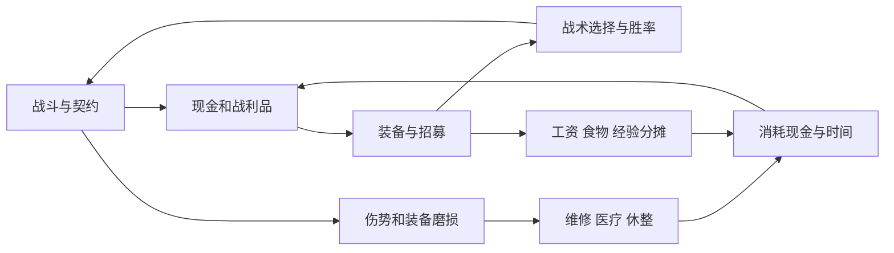

# 阿飞远征团全人物平衡方案 V1

日期：2026-09-29。状态：**完整设计提案，未实装。已做离线结构、成长、原版伤害公式、练习靶与经济预算验证；尚未完成实机平衡验收。**

用户确认本次先完成设计和验证，再决定实装。所有数字都是这一版可编辑的建议值，不覆盖当前游戏包，不把建议自动标为采纳。

## 阅读入口

- [全人物数值与招募总表.xlsx](全人物数值与招募总表.xlsx)：可编辑输入、升级分配、招募价、工资、伤害与概率公式。
- [34人角色手册](角色手册.md)：每人八维、天赋、个人成长两选一、技能三选一、招募与配装、构筑和弱点。
- [99项技能与3条转职](技能总表.md)：每项AP、疲劳、冷却、距离、效果、11级变化及现行版本对照。
- [研究与设计依据](研究与设计依据.md)：实际阅读范围、四本书的可核查材料、原版公式及战术。
- [验证结果与实测清单](验证结果.md)：已运行的检查、计算结果、哪些结论仍需要实测。

## 1. 这次重新平衡什么

目标是：三队长开局有生存工具但仍需要补员；34人都有可解释的用处和可替代者；7级第一次形成鲜明专属打法；11级完成构筑；后期根据敌人轮换，而不是把最强12人永远锁定。

当前有效名单34人：刀一10人、刀二8人、0.5DFW猪团14人、旅途来客2人。陈知含、米娜、糕糕、一凹瑶不回到战斗名单。罗一可仍用存档ID `xiaohani`，不生成重复人物。刘青松仍为剧情来客；小原大人、哈曼卡恩、四哥等剧情角色不因本方案变成可招募单位。

这不是全员统一加减八维。主要调整：重新配基础属性和成长预算；保留小酒瓶九星但拉开雇佣成本；将过强群体收益、免选中机制与低成本位移收回到有限用途；补齐眼子哥技能；明确后期补级、装备报价和34人收藏的支出。

所有队员是游戏中的虚构战术定位，不是在评价现实人物能力、性格或价值。

## 2. 属性与升级统一口径

表中八维顺序：生命、疲劳上限、决心、先攻、近攻、远攻、近防、远防。一级基础值不含装备、原版专长、心情/士气、临时技能、药剂、个人剧情及阿飞转职。星数是升级天赋，不是战斗属性增量。

新招募主题成员建议取消额外随机改变战斗八维的原版正负特性，保留独立背景、个人剧情成长、故事标签与专属选择。这样同一人物有稳定下限。旧档随机特性不强制删除，应单列为“旧档偏差”，不能直接拿新档表称已经一致。

|属性|0星每次随机范围|0星平均|1星平均|2星平均|3星平均|
|---|---:|---:|---:|---:|---:|
|近攻、近防|1～3|2|2.5|3|3.5|
|生命、疲劳、决心、远攻、远防|2～4|3|3.5|4|4.5|
|先攻|3～5|4|4.5|5|5.5|

从1级到11级，10次升级各选3项，合计30项。表里的培养方案已经逐人核查30项总额，绝不把八维都按十次升级相加。固定分配只是便于比较；实战可以按高点取舍调整。技能“天赋异禀”的额外属性、钢铁身躯的生命倍率等另算。手册额外给出钢铁身躯后的平均生命，其他专长未计入。

个人成长沿用现有每人两条故事分支：本人至少3级且实际参战至少3次，在安全地点二选一。选了其中一个特性，另一个永久不可同时获得。11级预估默认第一个选项；改选第二项时，必须把全套成长差值替换，不能累加。新表保留两条完整效果。

补级人物仍使用同一套随机升级与3项选择规则，给予未分配属性和技能点，不自动点满八项。总XP用原版阈值：1～11级累计为0、200、500、1000、2000、3500、5000、7000、9000、12000、15000。12级以后沿用老兵每次选3项各+1和原版工资规则，不新增专属技能分支。

## 3. 全局技能预算

保留7级三选一、11级精通，额外技能不占原版技能点，所以它们必须算进人物总预算。阿飞用3条转职路线，不能再额外领取普通成员三选一。没有被选中的两个技能绝不生效，包括经济收益。

|维度|本方案规则|防止的问题|
|---|---|---|
|命中|同一次攻击全部Mod正向双攻/命中加成合计最多+10；原版武器命中、士气、高低地仍照常；负面单独扣除|层数、标记、队长号令无限叠命中|
|常驻条件防御|Mod条件被动近防合计最多+6；小龟体质固定+5单列为种族成本|多个相邻关系被动叠成永久无敌|
|临时防御|同类护卫近防只取最高值，上限+8；远防同类取高；不与原版盾墙合并成重复拷贝|多个辅助围一个盾卫线性加防|
|群体支援|一次最多3名受益者，技能说明更小则按更小；含自身也占名额|3～4AP为12人同时供能|
|恢复|每名受益者每轮从全部Mod效果得到的额外恢复合计≤8；含11级被动精通和羁绊|多位支援串联回满疲劳|
|恢复例外|尼古丁单次15/18按独立每战一次预算；原版恢复技能及原版基础恢复不进这个Mod上限；透支照扣|把原版恢复也无意削弱，或取消透支|
|减耗|同类只取最高；最终费用不少于该技能原版专精/状态修正后费用的一半向上取整|攻击变零疲劳，引出高频循环|
|AP与位移|不给额外AP或免费普攻；专属位移每回合最多一次、每战通常2次；遵守同高、通行、定身限制|绕过原版脚步/轮换的机会成本|
|伤害|乘区必须命名；甲伤加成不转成血伤，附加破甲不再被百分比放大|两次结算同一加成|
|控制|写清适用种类、免疫、命中检定和结束时点；嘲讽是AI优先级，不是必中强控|对Boss、亡灵无差别控制|
|经济|购买优惠按真实成功交易消耗次数；不影响出售；契约额外收益按真实结算ID去重|反复读档、拆单、买卖、取消再接刷钱|

“回合”指角色自己的行动回合，“轮”指整个战场一轮。冷却CD=2：第1轮使用后，第2轮不可再用，第3轮才可再次使用；不得因等待、被控、读档或额外行动提前刷新。每战次数只在新战斗重置。状态时点优先按单项技能文字，不能把“下一次开始”实现成“第二次结束”。

群体受益对象由玩家选择；实现受限时用“自身优先→距离近→当前疲劳高→实体ID小”的稳定顺序，且UI提前显示。持续范围光环须持续验证距离；一次施加的限时增益不无故变成必须相邻，除非条目明确要求。

11级：有基础疲劳费用的主动技能费用减少15%，减免向下取整且至少1；不减少AP/CD，不增加次数。尼古丁由15改18恢复，其透支不变。被动技能额外让本人每轮恢复1疲劳，计入全局上限。小胖徐原文本额外近防成长被这一统一精通替代，不能再叠一份。

## 4. 招募流程与整体节奏

新稿在当前解锁体系上增加最低天数，用战斗/契约/探索/等级共同控制进度。天数是保险门槛，不替代其他条件。表中所有条件均为AND；同一阶段任何具体人物都不是其他人的硬前置，避免死亡或漏招把后续整队锁死。

“参战”沿用当前系统的个人历史参战最高值，不是多人参战累加，也不冒称战斗胜利数。契约只统计成功领取报酬的非送信契约；镇数统计不同非敌对、非军事聚落；最高等级取历史最高。建议不再把“曾招到多少主题成员”当新人物硬门槛，普通佣兵也可撑起过渡。

|阶段|最低天数范围|阶段目的|建议在队规模|装备与现金决策|
|---|---|---|---|---|
|开局|0|三队长构成盾、后排、成长位|3名主题+2～3普通佣兵|保留当前资源难度：钱2250/1800/1350，工具60/30/15，药22/15/7，弹50/25/12；50食物|
|补员|2～16|廉价盾卫、弓、投掷、救援与副旗；小酒瓶是一次较大投资|6～8人|先保粮钱、头盔和基础防具；不要求攒钱第一时间买九星|
|成形|18～28|成熟盾卫、弓弩、稳健通用角色|10～12人|形成可打普通契约的阵型；主题队员与普通佣兵竞争位置|
|分工|30～45|支援、长柄、决斗、旗手与特化应对|12+2轮换|先形成7级轻装/战铸，后买角色扩展；不为名册数量牺牲主力装备|
|专精|46～60|小龟、解网、先攻、破甲、救援与最后收集位|12+4轮换|把后来的角色练到功能位；不赠送终局甲和红装|
|收集|60日以后|补齐未选择人物、替换阵亡空位的战术功能|最高34主题，名册仍40|全收集是独立经济挑战；12人成熟阵容不要求全招|

候选槽保留3个、单槽招走后1日补位、候选保留4日、过期回队尾。换城候选随同迁移，不能重抽属性、价格或剩余有效期。资格获得后不消失，永不重复生成已招募、阵亡、永久离队者。主题成员的死亡是永久损失；替补是别的人或普通佣兵，不是复刻同一人。

队列给出的“达到资格日”不是实际遇见/雇佣日。满队、缺钱、长途旅行、候选排队都会推迟。验证分别给出熟练、常规、谨慎三组假设下的资格进度；它们不是采集的玩家数据。

### 后期补级

资格不受此规则改变。在候选**首次实体生成**时确定等级，之后移动城镇、过期排队或读档均保留：

`入队等级 = min(阶段上限, 1+floor((战团历史最高等级-2)/3))`，最低1。

阶段上限：最低出现日<26的角色上限1；26～45日上限2；46日及以后上限3。对应最高等级至少5才能给2级，至少8才能给3级。总表“规划入队等级”是达到阶段上限的预算版本，并不代表刚到最低资格就一定有该等级。招募界面必须明示真实等级与未分配点，价格随实际等级计算；3级也不自动算满足个人参战3次。

### 招募价与工资

每人独立服务费体现基础、天赋、技能潜力和出现时机；装备费与补级费另算。建议将当前 `recruitPrice` 改为一处拥有报价的计算：

`基础招募总价 = 向上取整到10(服务费 + 装备基础价值合计×0.60 + 120×(实际入队等级-1)^1.5)`。

这是一条新设计公式，不是原版商店价格公式。装备按全新基础价值计费，不把候选尚未使用的装备磨损当折扣。当前游戏已经直接写入候选报价，实装时不能再重复加一遍原版装备/等级费。最终城镇倍率仍只应用一次并在界面显示。折扣只作用服务费，所有招募旧折扣需要明确迁移。

一级日薪使用人物表，2～11级乘 `1.1^(等级-1)`，12级起再乘 `1.03^(等级-11)`。这遵守本机原版基础规律；实际还受起源、工资特性及经济倍率影响。预备队照付工资和食物。工作簿可编辑总工资倍率、每日食物单价与维修预算，查看现金底线。

原版招募还包括随机背景与装备组合，不能只拿“最低服务费”比较主题人物最终价。实机对照应从相同天数城镇抽取普通佣兵，按等级、实际装备、雇佣总价、日薪和可选专长分别比较。

## 5. 招募装备与长期装备曲线

每人实际携带物详见手册/工作簿。每件都核对了本机资源存在性及原版基础价值/疲劳。前期给50身甲、30头甲等起步组合；中期提高至80/40；后批主要95/105。小龟不带头盔，保留体质规则；投掷手带两捆标枪及小刀，弓弩带对应弹药，不能只写“远程套装”却漏弹药。

包内第二捆标枪计半疲劳；刀的负重为0。这个简化只适用于本方案的招募包配置；未来加双手武器、盾牌或腰带口袋专长后，必须按原版实际装备规则重算。招募装备全耐久，不附送经验药、属性药或永久增益。

|阶段|轻装路线|重甲路线|进攻装备|
|---|---|---|---|
|前期|先保证头身都有防护|无需为了未来战铸一开始就穿到只剩20疲劳|矛、剑、草叉，便宜盾，备用小刀|
|中期|7级轻装；甲盔疲劳目标≤15，合适名甲可另评|130～210甲过渡，战铸收益仍有限；先有装备再决定|长枪、猎弓、弩、投掷与基础双手；远程针对性更明显|
|后期|高生命、闪避/迅捷、低负重好甲；仍要防控制和穿透|目标约250～300身甲及合适重盔；裸血量、钢头、近防不能缺|双手锤/斧、决斗剑锤、重投掷、钩镰枪、战弓/重弩；按敌人换装|

名甲的优劣不能只看护甲值，轻装尤其要看疲劳。名武器同时抽到伤害、穿透、破甲或减疲劳上限时要测试极值，不能只用普通武器均值验收技能。

### 老马的垂直握把

保留名称、红装品质、双手锤定位和命中后追加破甲的辨识度。新参数提案：基础伤害70～90、破甲200%、穿透50%、装备疲劳-18、耐久100、价值12000；原版单体锤击另加20。追加破甲由现行40建议改25，结算后只扣同一命中部位剩甲，不溢出血伤、不放大、不跨部位，不作用横扫、反击、专属借用武器攻击或持续伤害。不是必定打碎任意护甲。

保留友好集市和武器店自然补货各5%的现行入口、一次库存周期最多新生成1件、库存已有则不追加。出现概率作用于合格实际补货，不是每次点开商店；存读档不得重抽。不给人物招募装备免费带入，不把刘青松改成武器硬前置，不追加首购战力奖励。

独立5%模型里：平均20次补货见到一次；至少出现一次的概率在20次约64.2%、40次87.1%、60次95.4%。中位14次，90%分位45次。两个同时合格的店各抽一次时至少一个出现的概率为9.75%，不是10%。库存抑制、实际补货间隔和路线会改变现实等待天数，这里不给虚构的“第几天必出”。

原版战利品、营地名装、契约对守军和掉落的影响先保持原规则，本稿不新增全局掉率。实装前需从本机对应地点/物品脚本另导出准确掉落池；不能把商店5%套到战斗掉落，也不能把损坏战利品当百分之百可卖的全价物品。

## 6. 队伍与经济如何互相制约

最后一条连接表示消耗对余额的扣减，不表示凭空产钱。重点是同时检查正反馈和制约：强角色帮助赢战，赢战给钱再买强角色；如果供能和经济技能再无限叠乘，整个消耗约束会失效。

建议队伍：

- **起步6人**：阿飞、王大谋、抹茶，加白小帅子与2名普通佣兵；李李/小月牙实际出现且现金充裕后再替换。第2日不应假定已满足第5～7日人物门槛。
- **通用12人**：阿飞、王大谋、小酒瓶、白小帅子、余初九、小鱼贝壳、眼子哥为前排/机动；抹茶、李李、亿口甜筒为后排；王怼怼副旗；老蔡可替换白小帅子或前排位置。重心是至少6个能接敌的角色，非固定身份锁定。
- **后期重甲与亡灵对策**：用瑶瑶牙/余想替换纯弓位，带双手锤/斧与投斧，小杰处理网；弱化恐惧相关选择。不是简单给全队加决心和命中就足够。
- **远程压力与救援**：大鹅、可可、王大芷任选其二维持防线；奶盖或小龟担任特化位；射手、旗手与解网位保持可相互支援的距离。不能把所有盾卫和辅助塞满12格而没有终结能力。

工资只是日支出的一部分。验证中的食物假设是每人2单位/日、每单位3克朗；维修、医疗、弹药及再投资都是可编辑预算，不是采集到的固定行情。战利品要用出售净收入，不用标价。工具是否值得先修再卖应比较增加的售价与所耗工具的实际购入成本。

营地、竞技场、危机、传奇地点保持其原有风险回报。本次不添加付费抽卡、付费加速、现实货币商业化；书中的商业化章节不适合直接套进这个单机Mod。

## 7. 事件、派系、收藏与永久增长

**阿飞电子烟也计入强度预算。** 当前“抽一口”为3AP/5疲劳，每回合最多一次、至多回20生命，长期战斗没有总量上限。提案改为4AP/10疲劳/CD2、每次至多15生命、每战2次，总治疗上限30；仍占饰品栏、仅阿飞可用，满血不可用、不修甲、不治伤、不复活。这个技能不接受成员11级精通减耗。战斗次数和冷却绑定角色并存档，换装备或重读不能重置。道具仍只发一次，遗失不重发，不可卖钱。

8轮且每轮至少缺20生命的理论上限，现行为160点，提案为30点；这是总量边界，不是实际存活率。减少的是无上限拖战回血，阿飞仍有两次应急治疗；4AP意味着当回合不能再用6AP双手重击。该效果必须与转职、轻装减伤及盾牌一起实测。

自行车保留现行一次性二选一：留下获得生命+2、决心+4；告别获得疲劳上限+5、先攻+3。34人标准成长列不默认已经完成这项支线，阿飞手册额外给出六种“路线×自行车”终局情景；不得把两条奖励同时加到一个人。

阿飞首次蛤蟆人/嘉豪改为7级、亲自参战6次、个人成长完成，免费；首次飞碟为9级、亲自参战12次、个人成长完成且六根开篇全部触发，免费一次。路线重修需9级、12份履约、1500克朗，并距上次转职至少7日。转职不重写天赋、不返还成长，不刷新同一战斗技能次数或滚动7日经济奖励额度。三条路线永久加成单列，不计入临时命中+10预算；战术号令计入。

六根仍是故事前置，涉及曾招募可可、小龟、余初九的历史标记；历史招募过后阵亡不清除标记。因此飞碟是收集支线的横向路线，不是每局必须取得的终局上位职业。这个支线依赖例外不改变一般人物招募彼此无硬前置的规则。

目前已经实现的派系事件、刘青松两次相遇、个人故事与结局继续沿用当前身份和剧情边界。一次性投喂是一次性资源，不作为每天收入计入预算；容量不足的奖励不能领取一半后反复刷。

曹飞派相关“斗志/决心”不能同时按两份强化计账。使用具体状态时要区分世界心情、战斗士气等级与决心属性；不得把记事里的“斗志+30或决心+20”转换为二者叠加。新实现若要改变效果或对象映射，必须先单列变更；本稿没有新增派系身份或新战斗人物。

当前源码已经选择下一场实际战斗决心+20、持续两次自身回合结束，并让阿飞承受两次各5的流血；加成采取补足至目标，不叠第二份20。本稿保留该现行版本作为稀有事件情景，标准练习靶不默认生效；须另测与嘉豪号令同时存在时的士气检定。绷带可处理流血，等待不多结算一次。

个人成长总共只选一个故事特性，专属技能只选一个方向，阿飞路线互斥。道具、事件、洗点不能反复领取基础八维。既有一次性事件奖励清单在实机验收时逐一挂到账本，不能把“稀有”当作无限永久加成的理由。

## 8. 实装边界与迁移要求

建议先在独立版本分两批：第一批属性/装备/价格/节奏，第二批技能重定义与转职。新档与旧档必须分别验收。既有用户修改、存档、发布ZIP和源代码在本次都保留。

- 基础值迁移只应用新旧差额一次，保留玩家升级点、姓名、装备、伤势、故事进度及已学原版专长。不要按11级预估反推覆盖真实人物。
- 新天赋影响尚未分配/未来升级队列，已分配属性不强行回收。阿飞路线不重写星数，防止重修重复刷队列。
- 旧档已选技能仍保留该技能ID，只替换参数；补齐眼子哥三个新ID时默认未选择。原文改名不用于存档查找。
- 已雇佣人物不补发招募装备、不返还差价、不直接补级。旧候选已显示的报价与有效期建议保持一次，再由新生成候选使用新公式。
- 世界事件已消耗的奖励/冷却不得重置。商品已有库存不重新抽5%，战斗中的技能次数不能靠读档恢复。
- 对其他Mod的命中、伤害、工资和候选显示钩子分别验兼容。全局上限只管理本Mod贡献，不能擅自封顶原版装备或其他Mod。

## 9. 怎样才算达到平衡验收

离线通过只是进入试玩的条件。本稿的结构检查、成长预算、伤害算式和练习靶数据已保存，真实战斗、99个技能分支的AI行为和玩家体验还没有采样。

建议验收目标（新设计阈值，并非原版公认常数）：同一位置、同等级、同装备下，专属技能带来的平均有效贡献相对普通佣兵尽量控制在约5%～12%；特殊克制局可更高，但不能在所有情境都胜过同类。相同角色三分支必须至少各有一种合理使用情境，不能用“玩家没选”直接证明弱。

实测先固定种子/敌军/装备/操作者进行配对，再换地图和经验层级。每个角色分支至少测试短战、8轮长战、被集火、无触发条件四种情境；全队至少测试人类盾墙、亡灵、兽人/蛮族、野兽、地精远程、精神压制。记录胜率、阵亡/永久伤残、回合数、技能实际使用率、恢复量、伤害、维修净成本和战后可用现金。

不以“每人胜率50%”作为单人PvE目标。发现一个组合全部战局占优时，先检查AP/覆盖人数/触发频率和结算顺序，再调基础值；发现某人只有身份情怀而无战术用途时，先给可辨认的作用，再考虑加攻击。

最终评价应是“在这些场景和样本内达到目标”，不能写“一定绝对平衡”。本方案提供能执行、能重算、能指出失败项的起点。
