# 旧技能与图标沿用审阅｜v0.13 历史评估

> 2026-09-28 名单更正：罗一可已替换蓝队误列的小哈尼，详见[现行制作名单](character-roster.md)。下文保留当时的映射与评估；罗一可旧项目 C30 技能和美术尚未因本次名单更正自动接入。

> 后续进度：v0.15 已覆盖 33 名伙伴、99 项成员技能，阿飞沿用独立转职。现行效果与移植调整见[已接入技能表](member-skills.md)；以下保留迁移前的评估、旧数值和当时待办，不作为当前生效清单。

日期：2026-09-27。依据已保存的旧工程快照、当前 34 人配置，以及本轮确认的九星核心／盾卫定位。本文是作者审阅与移植建议，不向游戏中的玩家公开未知人物或支线。

**结论：大部分图标可以原样保留，许多技能主题也值得沿用；现有代码需要逐项接入当前系统。此次没有改动游戏技能、安装包或存档，也没有生图。**

旧数据和可执行定义一致：32 人、97 项技能。目录有 91 张专属图标，另有两张电子烟可用／禁用图，均为 56×56 RGBA。

其中 30 位能直接对应当前人物，共 91 项旧设计、85 张现成图标。另有一凹瑶、罗一可的六项技能及图标继续存档，不将她们当成现有成员。

[按人物搜索和看图](../../build/legacy-skills-review/index.html) · [97 项机器可读清单与指纹](../../build/legacy-skills-review/inventory.json) · [逐人决策数据](../../data/legacy-skill-review.json)

## 图标能否直接用

- 已逐文件读取：所有 93 张 PNG 都符合现用技能栏的 56×56 RGBA 规格，技能路径应使用 `skills/…png`。旧图的暗红底、旧金符号、粗边框风格统一；按原尺寸总览检查后，大多数符号仍可辨认。这里只确认像素文件可复用，不代表每张图的语义和实机显示已经验收。
- 旧图无需为迁移而重画；沿用前核对名称与效果。例如旧全力圈是发光圆环，表达号令，不能拿它证明现版“圈钱”已对应。
- 审阅时电子烟两张技能状态图已在 v0.11 沿用。现版阿飞仍使用独立转职图标；v0.15 成员技能另已接入，当前规则以新版成员技能表为准。
- 小胖的站得住／借你半面盾／挨过这一口，蔓越莓的看清缝隙／红线记号／留一支给后面，这六项没有旧自定义图标。
- 老蔡、小哈尼、宋暖阳、溺水小龟在旧最终名册中没有自己的技能组。老蔡的旧技能已转给小宁，需要重新决定归属；其余三人不能宣称已有本人专属技能。
- 91 张普通专属图未各配一张禁用版；旧通用技能脚本直接把原色图用于禁用状态。若接入后不易辨认，另处理禁用显示，不必重画整套。

## 当前 34 人逐人建议

|成员|旧技能或候选|结论|当前适配意见|
|---|---|---|---|
|阿飞|哇哇叫／嘉豪／蛤蟆／全力圈|保留图标，按现转职重写|哇哇叫沿用现版自身强化；嘉豪的伙伴成长反馈可保留主题，但旧上限累加决心 +64、疲劳 +32，九星后应重新定上限。蛤蟆逃生可作分支候选。全力圈保留当前契约收入含义，旧回疲劳大招不能覆盖。|
|王大谋|偷大哥／大哥借我／一起抬|部分沿用，改盾卫定位|偷大哥只给已解锁候选折扣，不绕过当前招募队列和冷却。大哥借我要求友军永久近攻更高，开局大谋已最强，早期常无目标；建议改成可稳定使用的持盾协作。一起抬保留团队站位主题，攻防数值另调。|
|午夜抹抹茶|地精算盘／幕后队长|优先沿用设计|标记敌人、给队友节省武器疲劳很符合后排队长；地精出身依赖旧营地手动维修，应改接现有维修消耗记录后再启用。|
|小酒瓶|瓶队突破／决赛时刻／队友给的球|优先沿用设计|最贴合九星近战核心的一组。突破保留攻击后近防代价，决赛保留后程增伤与额外疲劳，接球鼓励集火配合；九星后重新校准命中增益，不能同时反复叠加。|
|白小帅子|小心脏／打鼓／守门|保留设计，调整号令接入|胆小但可靠的持盾风格清楚；打鼓应与现版阿飞号令统一持续时间和叠加规则，守门需要持盾及禁止移动。|
|李李超欧|无法选中／超巨／欧气|保留形象，复杂机制后置|图标和个人梗都清晰；无法选中牵涉敌方目标选择，欧气牵涉检定重掷，不宜首批移植。先采用有明确次数上限的被动。|
|小月牙|超市里／变态／乐天派|优先沿用设计|采购、换目标、士气保护有区分度；采购折扣需要接当前原版商店并防取消交易消耗次数，不能恢复旧黑旗办理入口。|
|余初九|狗叫／忠诚／护团换位|优先沿用设计|符合高先攻九星近战救场者。狗叫保留种族和精神免疫边界，忠诚只对当前出战核心判定；换位须检查网、眩晕、地形和双方位置。|
|小鱼贝壳|唯一的男人／尼古丁／顶上去|优先沿用主题，拦截后置|生命九星适合顶住缺口。被动近防 +6 需结合九星和盾牌重评；尼古丁是疲劳预支，不能与阿飞电子烟回血混写；顶上去须按实际武器攻击重定向，首批可先做明确的护卫效果。|
|王怼怼|恐飞派／太子发令／怼一句|保留梗，改旧依赖|旧恐飞派依赖阿飞群体哇哇叫，现版哇哇叫只强化本人，必须重写关系触发；代理发令和传递增益也须接当前出战者及效果系统。|
|老蔡|蓝旗布阵／稳一手／一张好牌|可回收旧组，归属待讨论|归档最终版已把旧 C11 那组三个技能归给小宁 C32；建议将布阵与稳一手回收给盾卫老蔡，近战好牌也更适合他。属于归属调整提案，不能自动挪走小宁能力。|
|小虎|探路／回头箭／接住后排|优先沿用设计|保留弓手和接应后排的方向；探路需对接原版护送契约，掩护箭要验证真实射击与脱离豁免，不能复制旧任务系统。|
|小宁|蓝旗布阵／稳一手／一张好牌|需要重设个人特色|现组三技是老蔡遗留的布阵近战风格，与外星人、流口水和当前弩手星位关联弱。图标仍保留，个人技能建议另围绕异常观察／干扰构思；未替用户定案。|
|小胖|站得住／借你半面盾／挨过这一口|保留机制，改街舞表达|盾卫类旧机制可用，但名字缺街舞特点。建议加入节拍、步点或队形触发，使其与五名主盾卫区分；三项都缺对应旧自定义图标。|
|大鹅|鹅势欺人／嘎嘎冲／守窝|优先沿用，强化守位重点|守窝与鹅势欺人很适合盾卫；嘎嘎冲会离开阵线，保留为有代价的位移选择。旧守窝只给远防 +6，不能宣传成全方面减伤。|
|蔓越莓|看清缝隙／红线记号／留一支给后面|保留远程协作骨架|远程集火适合现星位；红线的命名与控制目标可体现用户确认的 S 特点，但不擅自扩写真人含义。三项都缺对应旧自定义图标。|
|小哈尼|待补个人特点|没有对应旧技能组|可从未沿用角色的中性步法／配合机制取材，但不能把一凹瑶、罗一可直接当成小哈尼；先保持现有成长。|
|可可|自己人／保可梦／松口气|保留名称和图标，改成盾卫|旧自己人仅减少本人远程误伤，保可梦还奖励远程反击命中，与新矛盾定位不合。建议改邻接或短距护卫、保护成功后恢复疲劳，三个熟悉名字保留。|
|余想|五老压阵／长轮守门／替班到了|优先沿用设计|阵形、坚守、轮换十分贴合；当前长柄定位可做第二线支撑，避免直接复制主盾卫的同类叠加光环。|
|童猪|小熊出击／先懂规则／敲杯为号|优先沿用设计|观察敌人再干扰或支援，有完整的小循环；应共用一个有上限的观察层数，并改接新号令或独立冷却。|
|美伢|大王舞／看懂节拍／谢幕让位|优先沿用设计|与高先攻、灵活近战相符，旧图标齐全；舞步和撤步要使用当前安全位移判定，失败不能扣费或漏掉脱离攻击。|
|玩蛇|秦国的神／蛇形试招／下一招换个路|优先沿用设计|记录对手、试招、变招的循环有辨识度；应沿用原武器单体攻击，限定疲劳优惠和削弱次数。|
|涂涂|回头路／离席未散／再留一晚|保留救场设计，营地重做|断后和共同撤步可以留下；旧磨合与闹别扭系统现版没有，营地能力只保留主题，不能写成现成可用。|
|宋暖阳|围绕鹌鹑另设计|没有对应旧技能组|旧档没有这个成员的技能或专属图标；可设计胆小但会提醒危险的轻量被动，不从其他人强行改名冒充原作。|
|溺水小龟|小龟盾卫／飞爹羁绊|机制可借用，需新设专属|旧档没有小龟本人技能组。可借用护盾与守位代码，围绕缩壳、替飞爹扛事等方向讨论；九星核心之外的六星盾卫定位已明确，不公开未发现的六根线。|
|奶盖|嘴强王者／缩进奶盖／抽象整活|优先沿用设计|挑衅、防守、闪避后投掷形成独特玩法；挑衅须检查敌人是否真能攻击到奶盖，不让技能变成无风险控场。|
|小杰|锁车／不上这个当／备用钥匙|保留设计，陷阱后置|解网容易形成实用差异；陷阱涉及地块、进出战和工具支付，后续专项实现。不能与自行车行囊物品混淆。|
|bula|钱袋算清／提前分好／别把最后一支乱扔|优先沿用设计|预算与投掷特色完整。战前准备只给实际出战成员，交易折扣取最高而非叠加，不能靠预备队无限堆经济被动。|
|苏袜|踩点／抢半步／急刹|优先沿用设计|最适合现有先攻三星的一组；先攻变化须明确何时生效，不额外赠送行动回合或无限移动。|
|千涵|003号起跑／短坡冲刺／分段呼吸|优先沿用设计|开场机动和分段恢复特点清楚；冲刺需先验证完整两步路径，疲劳恢复有条件且每轮有限。|
|王大芷|站稳场子／撑住幕布／门口有我|优先沿用设计|旧芷芷已确认对应王大芷。持盾护身后人的技能很贴合现星位；光环与其他盾卫取最高或不同类别，避免无上限堆防。|
|瑶瑶牙|奶团吕布／破口一击／回看旗子|优先沿用，修改武器限制|符合疲劳九星双手核心。旧主动和被动限定双手长柄，现开局伐木斧不满足；建议改支持双手近战且使用武器自身合法距离，不强行让所有双手武器打两格。|
|羊咩咩|弯道留力／贴线绕行／铃铛带路|优先沿用设计|绕行与留下路径给伙伴形成特色。脚步标记只持续明确时段，不能通过反复进出同格刷恢复。|
|陈知含|月饼帮／这一盾记住了／先护住自己|优先沿用设计|营地准备与记住攻击者都很适合生命／决心／近防星位；补给须收费后只给下一战，避免取消或读档重复发放。|

## 需要先解决的代码和玩法冲突

1. **阿飞定义已变化。**旧哇哇叫是群体决心号令，现版是蛤蟆人的自身强化；旧嘉豪是累计伙伴成长的永久加点，现版嘉豪是带队路线；旧全力圈回疲劳，现版全力圈是战斗契约收入。名称、图标和有效机制分开选，不能覆盖新设定。
2. **九星后重评叠加。**旧技能常见命中 +10、近防 +6、伤害 +10% 与疲劳优惠，旧阿飞嘉豪奖励最多可累计决心 +64／疲劳 +32。保留条件、代价与次数限制，但不能将所有旧数值直接叠在新天赋上。
3. **旧共享号令在现版没有。**旧代码每战 2 次、觉醒后 3 次，且每轮最多 1 次；新阿飞技能按自身每战次数和克朗收费。必须先决定统一共享额度还是各技能独立冷却，不能只复制写着“耗一次号令”的技能说明。
4. **旧存档和身份键不同。**旧 `AfeiExpedition`、`afei_named_id`、`Cxx`、`scenario.afei_expedition` 应接到现版 `AfeixExpedition`、`afeix_character`、稳定英文键和新起源。不要带回旧 12 人出战、20／39 名册、驻营、章节与磨合门槛。
5. **攻击与位移不能整块覆盖。**旧 `attack_adapter.nut` 重写原生 `skills/skill.attackEntity`，拦截、误伤、武器技依赖这条链。建议优先按原版回调和当前边界接入，重点检验命中、盾牌、伤害、武器射程、网缚、地形、受控状态、失败不扣费以及读档。
6. **武器定位有具体不匹配。**瑶瑶牙当前伐木斧不是双手长柄，旧破口一击会无法使用；可可当前为矛盾，旧远程误伤减伤与远程追击几乎无用；小宁弩手与旧近战“一张好牌”也不对应。
7. **发现式流程继续保留。**人物技能可随招募与成长展示，未知成员、六根和转职不在 F8 预告。所有职业／技能清单仅供作者本地审阅。

## 当时建议的接入顺序（当前进度见页首）

- 第一批：小酒瓶的突破／接球、余初九的狗叫／忠诚、小鱼的站位被动／尼古丁、瑶瑶牙的吕布／破口；配合新九星配置形成不同近战玩法。武器技仍需走真实原生攻击并验证费用。
- 第二批：大鹅守窝、改造后的可可保可梦、老蔡布阵或稳一手、大谋的持盾协作，以及小龟的新盾卫机制。先让五名盾卫各有用途。老蔡回收小宁技能属于待讨论归属。
- 第三批：其他成员的经济、观察、步法和配合循环。小鱼拦截、强制换位、无法选中、陷阱、检定重掷等影响底层结算的机制独立验证后加入。
- 每人先选一个代表主动和一个特色被动，再把第三项放入成长阶段；这是节奏建议，尚未改现有成长选择。

## 全部 97 项旧设计与原图

以下数值原样摘录旧项目，用于比对，**不是当前已生效效果**。代码引用仅证明有文本／处理入口，不证明行为正确或实机通过。

### C01｜阿飞

**哇哇叫**（`wawa_call`，主动指挥）

4行动点、16疲劳、1次团队号令，自身与三格内可行动友军获得决心加成两轮。加成为6＋向下取整的（阿飞永久决心－20）÷5，最低6、最高20；永久决心只含基础、升级和一次性成长，不含装备、士气、旗帜及临时增益。它提高后续检定基础，不直接提升当前士气等级。

**嘉豪**（`jiahao`，成长被动）

阿飞仍在名册时，每位不同命名伙伴首次完成个人成长，给予他永久决心＋4、最大疲劳＋2，最多记录16人。抹茶、大谋计入，阿飞本人的成长与普通雇员不计；单纯签约不加点。已获得的奖励不因伙伴后来离队收回，死亡后不再新增。

**蛤蟆**（`toad_escape`，主动自保）

3行动点、10疲劳，每战一次。生命不高于最大值50%，或邻接至少两名敌人时，可移至相邻同高合法空地，免除此步的脱离攻击。自己须可行动且未被定身；不穿过单位、墙壁，不解除网缚，也不回复生命。

**全力圈**（`full_circle`，终局指挥）

满足终极觉醒后获得。4行动点、30疲劳、1次团队号令，每战一次，自身与四格内可行动友军立即恢复20点已积累疲劳，并获得决心＋20两轮。恢复前必须能支付自身30疲劳；受益者在效果到期时追加10疲劳，战斗结束或该受益者离场则清除未到期后劲。无行动点回复。

### C02｜抹茶

**地精出身**（`scrap_parts`，后勤被动）

抹茶在名册时，每累计实际消耗7点工具用于营地维修，获得1次余料减免，最多存3次。下次至少原需2工具的合法维修自动少耗1工具，并消耗一次减免；实际支付的工具才进入下一轮累计。不能修满耐久装备刷数；余料不变成背包物品。

**地精算盘**（`abacus_mark`，主动标记）

3行动点、10疲劳，给四格内一名可见敌人记账。下一次友军对该目标的单体武器攻击命中＋10，无论命中与否都耗掉标记；持续两轮，冷却两轮。抹茶同时只保留一组记账，新施放替换旧组。

**幕后队长**（`shadow_captain`，主动指挥）

4行动点、15疲劳、1次团队号令。指定四格内最多两名可行动友军，其下一次武器技能的疲劳成本减少8，最低0；两轮未使用则消失。同一人只存一份费用优惠，不能优惠另一项号令。

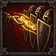

### C03｜王大谋

**偷大哥**（`steal_bro`，招募技巧）

每七日可谈成一次引荐，耗时2小时。为一名已经满足招募条件的候选人保留八折签约价，最多省200克朗；只保留一个报价，签约才算成功并开始七日冷却。更换未签报价仍须重新花2小时，不能凭空转移其他队伍的人或装备。

**大哥借我**（`borrow_strike`，主动取经）

2行动点、8疲劳，向三格内一名永久近攻高于自己的友军借招。接下来的两次单体近战武器攻击，命中增加双方永久近攻差，最多＋10；两轮后失效，冷却三轮。加成在施放时固定，不能复制临时增益或借招结果。

**一起抬**（`together_lift`，队形被动）

两格内至少有两名其他可行动友军时，近战护甲伤害＋10%，近战武器技能的疲劳成本减少2，最低0。按每次出手时的站位判断；费用优惠与其他技能取最高一份。此效果不再动态改变最大疲劳。

### C04｜小酒瓶

**瓶队突破**（`bottle_breakthrough`，主动武器技）

4行动点、18疲劳，使用当前单手近战武器的基础单体攻击打邻接敌人，命中＋10；按该基础攻击的伤害、护甲效率和命中部位结算。攻击后近防－5至下次自身行动开始，冷却两轮。技能费用替代该次基础攻击费用，不能套用双手武器。

**决赛时刻**（`finals_moment`，后程被动）

从第五轮开始，单体近战武器伤害＋10%，每次此类攻击额外积累3疲劳。只作用于实际出手，战后清除。等待本身不会增加层数，收不收残局仍由玩家判断。

**队友给的球**（`teammate_ball`，配合被动）

每轮第一次攻击本轮已被另一名友军单体武器攻击命中的敌人时，命中＋5。按真实敌对目标记录，范围擦伤、持续伤害与友军误伤不算；每轮最多一次。

### C05｜李李超欧

**无法选中**（`unselectable`，主动避险）

4行动点、20疲劳，每战一次，须没有邻接敌人。至下次自身行动开始，每当敌方选取单体技能目标，若还有另一名满足该技能全部选取条件的己方佣兵，李李从候选中排除；没有替代合法目标时正常可选。范围攻击、误射与地形伤害照常，主动攻击前解除。

**超巨**（`chaoju`，聚光被动）

每轮第一次对真实敌人的武器命中获得1层聚光，每轮第一次未命中失去1层；各结算一次，按先后顺序处理，最多3层。每层远攻＋3、决心＋3；所有层数战后清除。范围伤害与持续伤害不触发。

**欧气**（`ouqi`，士气被动）

每场第一次普通士气检定失败时，自动按同一概率重掷一次，采用第二次结果。先记录本次机会已消耗，再重掷；不重掷伤害、掉落、控制抗性或死亡判定。

### C06｜余初九

**狗叫**（`dog_bark`，主动干扰）

3行动点、12疲劳，对三格内可见的人类或绿皮敌人施加近攻－8，至该敌人下一次行动结束；冷却两轮。一次技能可影响其该次行动中的多次近战攻击。亡灵、野兽和精神干扰免疫者无效，同类削弱取最强一份。

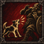

**忠诚**（`loyalty`，护团被动）

距本场护团中心两格内，余九决心＋10。中心优先为可行动的阿飞；他未出战、逃跑或失去行动能力时，切换为战前指定的代理队长。每轮中心第一次被敌方武器命中后，若余九当时在范围内，她近防＋4至轮末。没有有效中心则不触发。

**护团换位**（`guard_swap`，主动救援）

3行动点、15疲劳，每战一次，与相邻己方佣兵交换位置，双方免除此次移动的脱离攻击。两人均须可行动、未被定身，且互换后两处地块均可合法站立。不会解除眩晕、网缚或伤势；路径不成立时不扣费。

### C07｜小月牙

**超市里**（`supermarket`，补给技巧）

每个游戏日一次，主动选定商店当前确有库存的一笔食物购买，价格降低15%，最多省30克朗，成交价向上取整。同类折扣取最高值；取消交易不消耗次数，成功成交才计入当日记录。

**变态**（`biantai`，变招被动）

若本次远程武器攻击的目标不同于自己上一次远程武器攻击的目标，命中＋8，每轮最多触发一次。首发没有上次目标，不触发；同轮可以换目标，跨轮也保留最近目标，战后清空。记录的是尝试攻击，不要求上一次命中。

**乐天派**（`optimist`，士气被动）

每场第一次普通士气检定失败时，消耗一次乐天派并保持检定前的士气等级。一次只取消这次下降，后续独立检定照常；不移除已经存在的逃跑、魅惑或恐惧技能状态。

### C08｜小鱼贝壳

**唯一的男人**（`only_man`，接应被动）

邻接一名可行动且未持盾的伙伴，或邻接自己顶上去的受护者时，小鱼近防＋6。按当前副手装备与有效守护状态判断，人数不叠加，也不要求队友先受伤。名字沿用营中绰号，技能按装备与站位结算。

**尼古丁**（`nicotine`，主动预支）

2行动点、0疲劳，每战一次，立即移除15点已积累疲劳。随后两次自身行动开始的正常疲劳恢复各减少5，最低恢复0；没有可恢复的疲劳时不可发动。未偿还部分在战斗结束清除，不产生物品。

**顶上去**（`cover_up`，主动拦截）

4行动点、20疲劳，持盾指定一名相邻伙伴，自己保持原地至下次行动开始。期间该伙伴首次遭受单体近战武器攻击时，若攻击者也能用同一技能合法攻击小鱼，改以小鱼为目标，用她的防御、护甲重新结算，并令该击生命伤害减少15%。每次施放仅拦一击，尝试即消耗；冷却三轮。失去邻接、受护者离场，或小鱼不能行动、失去盾、被迫移动时，守护结束。

### C09｜白小帅子

**小心脏**（`small_heart`，条件被动）

两格内没有其她可行动友军时决心－8；持盾且邻接可行动友军时近防＋4。两种情况互斥，实时按站位判断；伙伴离场会改变条件，但不会自动触发额外士气检定。

**打鼓**（`drum`，主动指挥）

4行动点、16疲劳、1次团队号令，自身与三格内可行动友军获得定拍。每人下一次行动开始额外恢复8疲劳，并在该次行动结束前决心＋5；额外恢复计入该轮20点上限。跳过行动仍结算，已离场者清除，定拍不叠加。

**守门**（`guard_gate`，主动守势）

3行动点、12疲劳，须持盾，至下次自身行动开始不能移动。期间免疫第一次强制推拉位移，但伤害和其她状态照常；本次守势中的第一次普通脱离攻击命中＋10，仍遵守原有控制区与攻击次数规则。冷却两轮。

### C10｜王怼怼

**恐飞派**（`fear_afei`，关系被动）

每战第一次成为阿飞号令的受益者，立即恢复8疲劳；本轮下一次武器攻击命中－5，轮末未攻击则清除。主动使用怼一句后也清除这次惩罚。收益计入每轮20点恢复上限，其他人的号令不能冒名触发。

**太子发令**（`prince_order`，主动指挥）

4行动点、15疲劳、1次团队号令。仅当怼怼是战前指定的代理，且阿飞未出战、逃跑或不能行动时可用。自身与三格内可行动友军决心＋10、近防＋5，持续两轮。阿飞恢复行动只关闭新施放，已有增益正常到期。

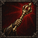

**怼一句**（`dui_sentence`，主动传令）

3行动点、10疲劳，冷却两轮。把自己仍有效的哇哇叫、稳一手或太子发令中的决心和近防加成，转述给三格内一名尚未收到该原始号令的可行动友军，剩余时间保持不变。每条原始号令最多转述给一人；不传递全力圈、定拍、费用优惠或位移免疫，也不消耗新号令。

### C12｜小虎

**探路**（`scout_path`，行军技巧）

每七日一次，花2小时调查一份已经接下的护送契约，揭示路线上的一项实际危险线索；优先揭示已存在的敌对活动，其次为难行路段。无新线索则不收费也不进入冷却。消息记查明时刻，之后变化的敌人位置不会自动更新。

**回头箭**（`return_arrow`，站位被动）

本轮完成至少两格普通移动后，第一次远程武器攻击命中＋7，每轮一次。换位、被推拉和专属位移不计步数；仍支付原武器费用，不能用原地来回获得永久增益。

**接住后排**（`catch_rear`，主动掩护武器技）

4行动点、18疲劳，消耗一发弹药，须持弓。选择二至四格内可见且射线合法的敌人，以及其相邻的一名伙伴，进行一次普通弓箭攻击，生命与护甲伤害均为该次攻击的50%。无论是否命中，该伙伴下次单格移动离开此敌人控制区时，免除仅来自此敌人的脱离攻击。标记至伙伴下一次行动结束失效，冷却三轮；不解除定身。

### C13｜大鹅

**鹅势欺人**（`goose_bully`，阵形被动）

至少邻接一名敌人，且邻接可行动友军数量不少于邻接敌人数量时，近攻＋5、决心＋5。每次相关检定即时检查；自己、替补席和远处队友不算人数。

**嘎嘎冲**（`gaga_charge`，主动推进武器技）

6行动点、22疲劳，冷却三轮。须用单手近战武器，先走到相邻同高、普通移动基础成本不高于2行动点的空格，再对邻接敌人作基础单体攻击，命中－5、护甲伤害＋10%。命中后把普通可推动人形敌人沿远离大鹅方向推一格，仅限同高合法空格；不满足推位条件则只有攻击。移动仍受控制区限制，费用已含一步与一次攻击。

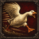

**守窝**（`guard_nest`，主动护卫）

3行动点、15疲劳，须持盾，保持原地至下次自身行动开始。自己与当前邻接友军远防＋6，离开相邻范围立即失去保护；新进入者可受益。冷却两轮，大鹅失去行动能力、放下盾或被迫离开原格则守窝结束。

### C14｜小杰

**锁车**（`lock_wagon`，主动布置）

4行动点、15疲劳、2工具，在相邻合法空地布置一处绳扣，每战最多布置两次。普通可束缚人形敌人主动踏入时，绳扣消耗并令其本次行动不能继续移动，至该次行动结束解除；仍能在原地攻击。己方安全通过，推拉与传送不触发；巨兽、飞行和束缚免疫者无效，不能放在单位脚下。

**不上这个当**（`not_fooled`，抗干扰被动）

抵抗明确属于恐惧或魅惑的技能时，检定采用决心＋15。常规受伤、包围和同伴阵亡导致的士气检定不加；该值只改变这次抗性检定，不转为永久决心，也不保证免疫。

**备用钥匙**（`spare_key`，主动解围）

3行动点、10疲劳，解除自己或相邻伙伴的一项网缚，冷却两轮。有网才可发动；不解除眩晕、敌方抓取和永久伤势。自身被网但仍能使用技能时也可自救，之后移动仍需正常成本。

### C15｜苏袜

**踩点**（`foot_point`，主动机动）

4行动点、12疲劳，冷却两轮，沿合法路线移动一至两格。每步须同高，地形的普通移动基础成本不高于2行动点；受控制区限制，不能越过单位。获得先攻＋15至下一次自身行动结束，成本已含移动，不再另收普通移动疲劳。

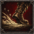

**抢半步**（`half_step`，先手被动）

单体武器攻击时，若自己的当前有效先攻高于目标，命中＋5，每轮最多两次。比较数值包含当时装备、已积累疲劳及临时修正；相等不触发，不额外插入行动。

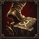

**急刹**（`hard_brake`，主动守势）

3行动点、14疲劳，冷却三轮，至下次自身行动开始远防＋12、近防＋4；发动后本次行动不能继续主动移动。被迫移动会提前结束急刹，正常射击仍可进行，其他守势与同类防御加成按共同上限结算。

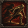

### C16｜涂涂

**回头路**（`return_road`，主动协同撤步）

4行动点、18疲劳，每战一次。自己与一名相邻、可行动且未被定身的伙伴，沿同一方向各移动一格，双方免除此步的脱离攻击，成本全部由涂涂承担。两条路线须同高且相邻可达，按两人同步离开起点后检查空位，不得碰到第三单位；不能穿墙或强制撤离战场。

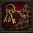

**离席未散**（`leave_not_gone`，断后被动）

本场第一次有己方佣兵成功撤离后，涂涂决心＋10、近防＋5，持续两轮。只触发一次，阵亡、被抓取和暂时换位不算撤离；不会抵消本场撤退的经营与磨合代价。

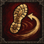

**再留一晚**（`one_more_night`，营地技巧）

每七日一次，安全扎营花6食物、4小时，磨合＋3，并清除至多两名自选成员的本起源闹别扭标签。没有标签时仍可为磨合使用。不能在追击中发动，也不治疗伤势或清除欠薪、饥饿造成的心情问题。

### C17｜可可

**自己人**（`own_people`，射击被动）

自己的远程武器误射到友军时，该次友军生命与护甲伤害减少50%，向下取整。原来的命中结果、弹药和攻击成本不改，也不会改射中敌人。对主动指定友军的攻击无效；不能用它替代射线判断。

**保可梦**（`pokemon`，主动守望）

4行动点、16疲劳，指定四格内一名其他伙伴，远防＋8，持续两轮，冷却三轮。期间该伙伴遭单体敌方武器攻击后，记住最近那名可见攻击者；可可每轮第一次对当前记录者的远程攻击命中＋8。只保留一名受护者和一个威胁记录，目标或守望失效时记录清除。可可离场、死亡或失去行动能力时，守望整体结束。

**松口气**（`breathe_easy`，守望被动）

保可梦仍有效时，受护者每轮第一次被敌方单体武器攻击且未被命中，可可立即恢复4疲劳。每轮一次，计入20点上限；对方主动闪避仍须按实际命中结果，友军攻击与范围技能不触发。

### C18｜童猪

**小熊出击**（`bear_strike`，主动干扰）

3行动点、12疲劳、1层看懂，冷却两轮，每战最多两次。对三格内可见的人类或绿皮敌人施加下一次武器攻击命中－10，持续两轮或攻击尝试后消耗；精神干扰免疫者无效。木熊是手中道具，不生成单位或占格。

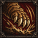

**先懂规则**（`know_rules`，观察被动）

童猪可行动时，四格内可见敌人连续两次使用同一种武器攻击技能时，获得1层看懂，最多2层、每轮最多获得1层。按每个敌人分别记录最近的武器技能，命中与否均记录；非武器行为不提供层数。同一事件只计一次，离开视野期间不补记，战后清空。

**敲杯为号**（`cup_signal`，主动指挥）

4行动点、15疲劳、1次团队号令。指定三格内最多三名可行动友军，自选额外消耗0至2层看懂；每人的下一次武器技能或非指挥专属主动技巧少耗4＋2×所消耗层数的疲劳，最低0，两轮到期。优惠取最高一份，不减少行动点、工具和弹药，不优惠其她号令。

### C19｜奶盖

**嘴强王者**（`mouth_strong`，主动挑衅）

2行动点、8疲劳，冷却三轮。选择一名邻接、可见且不免疫精神干扰的普通人类敌人；其下一次单体近战武器攻击若能合法攻击奶盖，就必须优先选择她，至该敌人下一次行动结束失效。不强迫移动，不影响远程、范围或特殊能力；目标当前没有合法近战武器攻击时不可发动。

**缩进奶盖**（`shrink_cover`，主动守势）

4行动点、18疲劳，须持盾，至下次自身行动开始不能主动移动或攻击，近防＋8。期间前两次直接武器伤害结算到生命的部分减少20%，冷却三轮；持续伤害照常。失去盾、失去行动能力或被迫移动则结束，已触发的返场仍按自身期限保留。

**抽象整活**（`abs_comeback`，返场被动）

每轮第一次敌方单体武器攻击未命中自己，或自己在缩进奶盖期间承受此类攻击后存活，获得1层返场，最多存1层。下一次投掷武器攻击命中＋10，尝试后消耗，最迟下一轮末到期。无额外攻击或免费换武器；友军攻击不触发。

### C20｜余想

**五老压阵**（`five_elder`，阵形被动）

自身邻接至少两名友军时，近防＋4、决心＋6；邻接条件失去立即结束。不会向全队广播，也不增加最大生命。

**长轮守门**（`long_watch`，主动守势）

4行动点、18疲劳，冷却两轮。至下次自身行动开始，近防与远防各＋8、先攻－10。期间每轮首次被单体攻击命中后恢复4疲劳；不减免该击伤害。

**替班到了**（`shift_arrive`，协作被动）

每轮一次：自身本次行动开始时，若仍邻接上轮没有邻接过自己的友军，恢复5疲劳。必须有真实位置变化，待机与重复读入战场不算换班。

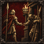

### C21｜美伢

**大王舞**（`king_dance`，主动支援）

4行动点、16疲劳，冷却两轮。移至相邻同高合法空地，普通脱离攻击照常触发；移动后相邻的至多两名其他友军获得先攻＋12，持续到各自下次行动结束。不改变本轮已确定的行动顺序。

**看懂节拍**（`read_beat`，反应被动）

每轮一次，邻接友军对某敌人单体近战未命中后，记录该敌人。自身下次对它的单体近战命中＋6，出手即消耗；标记至本轮结束，最多一个。

**谢幕让位**（`curtain_yield`，主动步法）

2行动点、8疲劳，每轮一次。仅在本次行动已用单体近战命中后，移至相邻同高合法空地。仅免刚才受击敌人的脱离攻击，其他敌人照常；定身时不可用。

### C22｜陈知含

**月饼帮**（`moon_cake`，营地准备）

每72小时一次，消耗6食物与2小时。指定本人和两名在队伙伴，下场出战时前两轮决心＋6；七日未出战则失效，同一人只保留一份月饼准备。

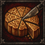

**这一盾记住了**（`remember_shield`，防御被动）

持盾时，每轮首次被单体近战命中后，至本轮结束对同一攻击者额外近防＋6。不抵消已经承受的伤害；一次只记一个攻击者。

**先护住自己**（`guard_self`，主动守势）

4行动点、16疲劳，冷却两轮，须持盾。至下次自身行动开始，额外近防＋8；该期间首次受到的生命伤害减10%，先结算护甲，不提供复活或伤势免疫。

### C23｜千涵

**003号起跑**（`start_run`，开场被动）

本人第一次行动中，第一次普通同高平地移动少消耗2疲劳，最低0；仅该次移动先攻不额外变化，无行动点优惠。

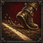

**短坡冲刺**（`short_sprint`，主动步法）

3行动点、14疲劳，冷却三轮。沿同高合法空地最多移动两格，不能穿人，普通脱离攻击照常。落点的本次下一次单体近战命中＋8，行动结束失效。

**分段呼吸**（`segment_breath`，恢复被动）

本次行动没有使用任何攻击、支援或专属主动技能，且结束时不邻接敌人，则恢复8疲劳，每轮一次。仅移动或待机可以满足，但跨多次待机仍只结算一次。

### C25｜玩蛇

**秦国的神**（`snake_read`，对手记录）

每轮首次被某敌人单体近战攻击后记住它，命中与否均可。下次对该敌人的单体近战命中＋6，出手即消耗；至下次自身行动结束失效，最多一个。

**蛇形试招**（`snake_trial`，主动武器技）

4行动点、16疲劳，持单手近战武器，对相邻敌人打一击，武器生命与护甲伤害各为普通攻击的80%。命中后该敌人至下次行动结束近攻－6，同一敌人每轮只能受一次。

**下一招换个路**（`next_path`，变招被动）

本次行动先以普通单体近战命中A，再以蛇形试招攻击不同敌人B时，蛇形试招少消耗4疲劳。只省疲劳，不复制第一次攻击，也不增加攻击次数。

### C26｜芷芷

**站稳场子**（`hold_ground`，邻接被动）

持盾且本次行动未移动时，至下次自身行动开始，邻接的其他友军各获近防＋3；离开邻接即时结束。本人不从此技能获得防御。

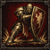

**撑住幕布**（`hold_curtain`，主动守势）

4行动点、18疲劳，冷却两轮，须持盾。至下次自身行动开始，近防＋7并获得一次强制位移免疫；仅阻止一次推拉，不阻止伤害和眩晕。

**门口有我**（`door_mine`，近战被动）

每轮一次，对邻接且与至少两名友军接壤的敌人进行普通单体近战时，命中＋5。只作用于该次普通攻击，不追加一次攻击。

### C27｜瑶瑶牙

**奶团吕布**（`lvbu_weapon`，武器被动）

持双手长柄近战武器时，首次攻击未受本起源标记的敌人，武器生命与护甲伤害各＋10%，每名敌人每战一次。攻击尝试即记名，未命中也不能重刷。

**破口一击**（`breach_strike`，主动武器技）

6行动点、24疲劳，冷却两轮，用双手长柄武器对合法距离敌人打一击，命中－5，伤害按普通单体攻击。命中后若目标可被推移且背后同高空格合法，则推开一格；否则只结算攻击。

**回看旗子**（`look_flag`，站位被动）

本人行动结束时若三格内有当前出战团长或战前代理，且本次至少移动过一格，决心＋6至下次自身行动开始。旗手不在场则不触发。

### C28｜羊咩咩

**弯道留力**（`curve_force`，移动被动）

每次自身行动第二次普通同高平地移动少耗3疲劳，最低0；每轮一次。只优惠疲劳，不减少行动点，不作用于专属位移。

**贴线绕行**（`line_detour`，主动步法）

3行动点、12疲劳，冷却两轮，沿相邻同高空地移动一格。若起点与终点都邻接同一敌人，该敌人的脱离攻击不会触发；其他敌人照常，定身不可用。

**铃铛带路**（`bell_lead`，协作被动）

本人结束行动后，记下本次普通移动最后离开的合法空格。首名本轮走入该格的友军恢复3疲劳，随后清除。地格被敌人占据或本轮结束也清除，最多一处。

### C29｜一凹瑶

**反应半拍**（`half_react`，先手被动）

本轮尚未待机时，第一次普通单体近战对本轮尚未行动的敌人命中＋6。若敌人已经行动则不触发，每轮一次。

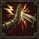

**接住这一棒**（`catch_baton`，主动协作）

2行动点、10疲劳，每轮一次。指定两格内一名其他友军，其本次下一次单体攻击命中＋5，至本轮结束；该友军若本轮已行动结束则不可选，同类接力不叠加。

**鸭步回身**（`duck_turn`，反应被动）

每轮首次被单体近战未命中后，获得先攻＋10至下次自身行动结束。不会立刻插入行动队列，也不自动后撤。

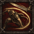

### C30｜罗一可

**脚下两步**（`two_steps`，位置被动）

本次行动只进行过一次普通移动且该步为同高平地时，下一次短矛普通近战命中＋5，出手消耗。额外移动和专属位移会取消。

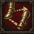

**门前卡位**（`door_block`，主动技巧）

4行动点、15疲劳，冷却两轮，选择相邻敌人。按本人近攻＋5对其近防进行一次命中检定，不造成伤害；成功后推往由玩家预选的相邻同高空格，该格须也邻接目标原格且不更靠近施放者。不可推移者不能选。

**长跑留一口**（`long_run_breath`，疲劳被动）

当前积累疲劳不低于有效上限60%时，普通近战攻击的疲劳少2，最低0；每次都按出手前检查。只优惠疲劳，不解除体力上限。

### C31｜bula

**钱袋算清**（`purse_clear`，交易被动）

bula在常备队伍时，每日首次购买工具、药品或弹药的一笔价格降低5%，单笔最多省30克朗。与其他本起源交易折扣取最高，不影响出售、工资和招募。

**提前分好**（`budget_share`，战前准备）

每战部署时指定本人或一名其他出战投掷手，该角色本战首次普通投掷少耗5疲劳，最低0。不赠弹药、不制造一次攻击，受益者离场则作废。

**别把最后一支乱扔**（`no_last_throw`，投掷被动）

本人手持投掷武器只剩1发时，该发普通投掷命中＋6；使用后正常消耗弹药。补充弹药再到1发时每战最多再次触发一次，总计两次。

### C32｜小宁

**蓝旗布阵**（`blue_form`，开场被动）

第一轮开始，自身与当时邻接的可行动友军先攻＋12，持续至第一轮结束。受益者按开场位置锁定；同类开场先攻取最高值，不额外获得行动点，也不在增援入场时再触发。

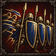

**稳一手**（`steady_hand`，主动指挥）

4行动点、18疲劳、1次团队号令。指定四格内最多四名可行动友军，近防＋6、决心＋6，持续两轮；每人另获一次强制推拉位移免疫，使用或到期后消失。攻击伤害和其她状态正常结算；不能与守门把同一次推拉重复计为两次免疫。

**一张好牌**（`good_card`，配合被动）

同轮有两名不同队友以单体武器攻击命中同一敌人后，持有者下一次对它的单体近战攻击命中＋10，每轮一次。须在本轮完成出手；不生成额外攻击，持续伤害不计入条件。

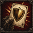

### C33｜小胖

**站得住**（`pang_anchor`，持盾被动）

持盾且邻接至少一名可行动友军时，自身近防＋4。离开队友身边立即失效；不增加护甲或生命。

旧自定义图标缺失。

**借你半面盾**（`pang_share`，主动护卫）

3行动点、12疲劳、冷却两轮。指定相邻一名可行动友军，使其近防＋4、决心＋4，持续至下轮结束；重复施放刷新持续时间，不叠加。成长后近防提升至＋6。

旧自定义图标缺失。

**挨过这一口**（`pang_breath`，受击被动）

每轮首次被单体武器攻击命中后，若仍可行动，恢复3点已积累疲劳。受黑旗每人每轮20点恢复上限约束；未命中或持续伤害不触发。

旧自定义图标缺失。

### C34｜蔓越莓

**看清缝隙**（`berry_eye`，远攻被动）

对邻接至少一名友军的敌人进行普通单体远程武器攻击时，每轮首次命中检定获得远攻＋5。攻击尝试即耗掉本轮机会；不作用于范围攻击。

旧自定义图标缺失。

**红线记号**（`berry_mark`，主动标记）

3行动点、10疲劳、冷却两轮。标记四格内一名可见敌人，持续两轮；下一次友军单体远程武器攻击对其远攻＋8，尝试后无论命中与否清除。蔓越莓同时只能保留一个记号。

旧自定义图标缺失。

**留一支给后面**（`berry_reserve`，协作被动）

本人每轮首次普通远程武器攻击命中邻接友军的敌人后，恢复2点已积累疲劳。受黑旗每人每轮20点恢复上限约束；未命中不触发。

旧自定义图标缺失。

## 来源与本轮检查范围

- [旧设计数据](../../legacy/2026-09-25-afei-expedition/reference/data/document-v0.6.2.json)
- [旧实际技能定义](../../legacy/2026-09-25-afei-expedition/reference/src/scripts/mods/afei/definitions.nut)
- [旧技能通用入口](../../legacy/2026-09-25-afei-expedition/reference/src/scripts/skills/afei_skill.nut)
- [旧技能支付和目标检查](../../legacy/2026-09-25-afei-expedition/reference/src/scripts/mods/afei/actions.nut)
- [旧战斗被动与号令](../../legacy/2026-09-25-afei-expedition/reference/src/scripts/mods/afei/combat.nut)
- [旧原生攻击覆盖](../../legacy/2026-09-25-afei-expedition/reference/src/scripts/mods/afei/attack_adapter.nut)
- [现版个人成长](../../data/member-growth.json)、[转职](../../src/scripts/mods/afeix/promotions.nut)、[九星属性表](character-stats.md)

执行旧数据定义导出并核对 97 项 ID／姓名／归属；读取 PNG 的尺寸、模式和 SHA256；阅读代表技能的支付、目标、战斗和攻击适配代码。没有执行旧安装脚本，没有对 97 项技能逐一做行为测试，也没有启动游戏。
